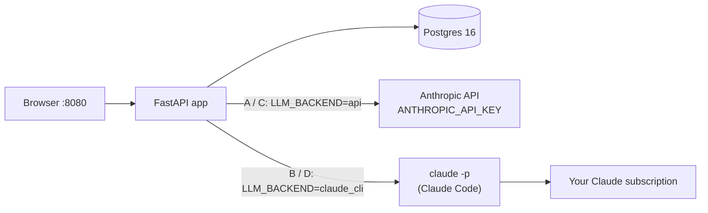

# Runbook — running Greek Tutor

How to start, check, stop and update the app in each of its four run modes. Commands are
PowerShell on Windows unless marked otherwise. For what the app *is*, see `README.md`; for the
build plan, `docs/handoff-items/00-ROADMAP.md`.

> **Status (2026-09-26):** these steps were written against the code on `feature/llm-backends`
> but have **not yet been run end to end** (Docker Hub and PyPI were unreachable where they were
> written). Roadmap stage 01 is that first run. If a step fails, fix it here in the same commit.

## At a glance (Five Ws + How)

| | |
|---|---|
| **What** | A FastAPI web app + PostgreSQL. Each tutor turn calls a Claude model. |
| **Who** | You, as the single learner (subscription modes allow only one account). |
| **Where** | Your PC, reached at `http://127.0.0.1:8080`. Later, behind Caddy / Cloudflare Tunnel (roadmap stage 06). |
| **When** | Pick a mode once; switching later is a `.env` change plus a restart. |
| **Why four modes** | Two independent choices: *how it runs* (Docker or Python on the host) × *how it pays for Claude* (API key or your Claude subscription). |
| **How** | Section 1 (every mode), then your mode's section, then section 3 to check it works. |

## Choose a mode

| | **Pays with an API key** | **Pays with your Claude subscription** |
|---|---|---|
| **Docker** | [A. Docker + API key](#a-docker--api-key) — the default; start here | [B. Docker + subscription](#b-docker--subscription) |
| **Python on the host** | [C. Python + API key](#c-python--api-key) | [D. Python + subscription](#d-python--subscription) |

| Question | API key | Subscription |
|---|---|---|
| Cost | Per token, billed to the Console account | Counts against your Pro/Max usage limits |
| Learners | Any number | **One.** Signup closes after the first account; the app refuses to start with two |
| Speed per turn | Fast | A few seconds slower (one `claude` process per turn) |
| What it needs | `ANTHROPIC_API_KEY` | Claude Code installed and signed in (`claude setup-token` or `claude /login`) |

| Question | Docker | Python on the host |
|---|---|---|
| Good for | Daily use, the homelab later, running the test suite | Editing code with fast reloads |
| Needs | Docker Desktop (WSL 2 backend) | Python 3.12+, and a Postgres — the compose one or a Windows install |



### Primer: why the subscription modes work the way they do

Anthropic's terms let you sign in to the **unmodified** Claude Code program with your own
subscription. They don't allow apps to use that login directly or to serve other people on your
plan. So in subscription mode the app runs the real `claude` binary for each turn: no tools, none
of your own Claude Code hooks, plugins or `CLAUDE.md` (`--safe-mode`), and a scrubbed environment.
It also refuses a second learner. The environment scrubbing matters because the `claude` program
prefers an `ANTHROPIC_API_KEY` over your subscription whenever it sees one.

---

## 1. Before any mode

| Step | Command / action | Why |
|---|---|---|
| 1.1 | `cd C:\Users\ibats\Documents\Projects\greek-tutor` | Every command runs from the repo root |
| 1.2 | `git switch feature/llm-backends` (until it is merged) | The subscription option and this runbook live here |
| 1.3 | `Copy-Item .env.example .env` | Your settings; `.env` is git-ignored |
| 1.4 | Generate two secrets (below) and put them in `.env` | Database password and cookie secret |
| 1.5 | Set `APP_TIMEZONE=America/New_York` in `.env` | So "today" matches your evenings (quota, SRS, cycle) |
| 1.6 | Check port 8080 is free (below) | Otherwise set `APP_PORT` to something else |

```powershell
# 1.4 — URL-safe random secrets (paste into POSTGRES_PASSWORD and COOKIE_SECRET)
-join ((1..24) | % { '{0:x2}' -f (Get-Random -Max 256) })
-join ((1..32) | % { '{0:x2}' -f (Get-Random -Max 256) })

# 1.6 — is 8080 in use, or inside a range Windows reserves for Hyper-V/WSL?
Get-NetTCPConnection -LocalPort 8080 -State Listen -ErrorAction SilentlyContinue
netsh int ipv4 show excludedportrange protocol=tcp
```

Use the same password in `POSTGRES_PASSWORD` and inside `DATABASE_URL`. Docker ignores
`DATABASE_URL`, but the Python modes use it.

---

## 2. Start the app

### A. Docker + API key

**Needs:** Docker Desktop running; an API key from <https://platform.claude.com>.

`.env`:

```ini
LLM_BACKEND=api
ANTHROPIC_API_KEY=sk-ant-...
WITH_CLAUDE_CLI=false
```

```powershell
docker compose up -d --build
docker compose logs migrate        # expect: apply 001..003, seed lessons_a1.sql, seed harada.sql
docker compose ps                  # app should become "healthy" within ~30 s
```

Then do section 3.

### B. Docker + subscription

**Needs:** Docker Desktop running; a Claude Pro or Max plan; Claude Code on Windows to mint the
token (`irm https://claude.ai/install.ps1 | iex` if `claude --version` fails).

1. Mint a long-lived token **on Windows** (opens your browser; the token is valid for one year and is printed once, not saved):

   ```powershell
   claude setup-token
   ```

2. `.env`:

   ```ini
   LLM_BACKEND=claude_cli
   CLAUDE_CODE_OAUTH_TOKEN=<paste the token>
   # installs Claude Code into the image
   WITH_CLAUDE_CLI=true
   # pin an exact version (e.g. 2.1.283) once it works
   CLAUDE_CLI_VERSION=stable
   ```

   An `ANTHROPIC_API_KEY` left in `.env` is harmless: the app strips it from the `claude` process.

3. Build and start. `--build` is required whenever `WITH_CLAUDE_CLI` or `CLAUDE_CLI_VERSION` changes:

   ```powershell
   docker compose up -d --build
   docker compose exec app claude --version     # proves the binary is in the image
   docker compose logs app | Select-String "LLM backend"   # expect: LLM backend: claude_cli
   ```

4. Do section 3. **Sign up exactly one account.** A second signup returns 403 by design.

### C. Python + API key

**Needs:** Python 3.12+ (`py -3.12 --version`); a Postgres. The simplest option is the compose
database; Docker then runs only Postgres.

1. Database — pick one:

   | Option | Commands | `DATABASE_URL` in `.env` |
   |---|---|---|
   | **Compose Postgres** (recommended) | `docker compose up -d db` | `postgresql://tutor:<POSTGRES_PASSWORD>@127.0.0.1:5433/greektutor` |
   | Postgres installed on Windows | Install PostgreSQL 16 (EDB installer or `winget search PostgreSQL`), then the SQL below as the `postgres` user | `postgresql://tutor:<password>@localhost:5432/greektutor` |

   ```sql
   -- Windows-installed Postgres only (psql -U postgres)
   CREATE ROLE tutor LOGIN PASSWORD '<password>';
   CREATE DATABASE greektutor OWNER tutor;   -- owner may create the trusted citext extension
   ```

2. `.env`:

   ```ini
   LLM_BACKEND=api
   ANTHROPIC_API_KEY=sk-ant-...
   # fine on http://127.0.0.1; see troubleshooting for LAN IPs
   COOKIE_SECURE=true
   ```

3. Virtual environment, then load `.env` into this PowerShell window. The app reads real
   environment variables; PowerShell has no `source .env`, so step 3 includes a loader:

   ```powershell
   py -3.12 -m venv .venv
   .\.venv\Scripts\Activate.ps1          # if blocked: Set-ExecutionPolicy -Scope CurrentUser RemoteSigned
   pip install -r requirements.txt

   # Load .env into this window (re-run after every .env edit)
   Get-Content .env | Where-Object { $_ -match '^\s*[A-Za-z_][A-Za-z0-9_]*=' } | ForEach-Object {
     $k, $v = $_ -split '=', 2
     $v = ($v -replace '\s+#.*$', '').Trim().Trim('"')   # drop inline comments and quotes
     [Environment]::SetEnvironmentVariable($k.Trim(), $v, 'Process')
   }
   ```

4. Migrate, then run:

   ```powershell
   python scripts/migrate.py                      # apply 001..003, seed ×2
   uvicorn app.main:app --host 127.0.0.1 --port 8080 --reload
   ```

5. Do section 3.

### D. Python + subscription

**Needs:** everything in C, plus Claude Code on Windows signed in to your Pro/Max account.

1. Install and sign in, if you haven't:

   ```powershell
   irm https://claude.ai/install.ps1 | iex    # then open a new window
   claude --version
   claude                                     # first run opens the browser sign-in; exit with /exit
                                              # or: claude setup-token and paste the token below
   ```

2. `.env`:

   ```ini
   LLM_BACKEND=claude_cli
   # empty = use the login from step 1; or paste a setup-token
   CLAUDE_CODE_OAUTH_TOKEN=
   # or a full path, e.g. C:\Users\ibats\.local\bin\claude.exe
   CLAUDE_CLI_PATH=claude
   ```

3. Do steps 1, 3 and 4 of mode C (database, venv plus `.env` loader, migrate plus uvicorn).
   Watch the uvicorn output for `LLM backend: claude_cli`.

4. Do section 3. **One account only.**

> Starting uvicorn from a terminal *inside* Claude Code is safe: the app drops all inherited
> `CLAUDE_CODE_*` / `ANTHROPIC_*` variables before running `claude`. Without that, the child
> would join the parent's Claude Code session and ignore the tutor prompt. This was seen while
> the feature was being written, which is why the scrubbing exists.

---

## 3. Check it works (every mode)

| # | Check | Expect |
|---|---|---|
| 3.1 | `Invoke-RestMethod http://127.0.0.1:8080/healthz` | `ok : True` |
| 3.2 | Open `http://127.0.0.1:8080`, sign up | Redirects to the board (9×9 grid) |
| 3.3 | Save the goal and cycle target on the board | "Day 1 of 90" |
| 3.4 | Focus 3 cells (e.g. letters, 10 new words, gender from ending) | Focus count 3/5 |
| 3.5 | *Start today's session*, send a few Greek lines | Tutor replies in Greek plus English, ends with a question; no raw JSON visible |
| 3.6 | End the session | A recap; the focused cells show progress on the board |
| 3.7 | Subscription modes only: sign up a second account in a private window | 403 "Signup is closed…" |

If 3.5 comes back as "Claude Code" introducing itself, the system prompt wasn't applied. Stop
and report it: it's the one thing about the CLI path that could only be checked with a real login.

---

## 4. Everyday operations

| Task | Docker (A/B) | Python (C/D) |
|---|---|---|
| Start | `docker compose up -d` | load `.env`, activate `.venv`, `uvicorn …` |
| Stop | `docker compose down` (data kept) | Ctrl+C; `docker compose stop db` if you use the compose DB |
| Logs | `docker compose logs -f app` | the uvicorn window |
| After `git pull` | `docker compose up -d --build` (the migrate service runs first) | `pip install -r requirements.txt`, `python scripts/migrate.py`, restart uvicorn |
| Run the tests | `docker compose --profile test run --rm test` | `pip install -r requirements-dev.txt`, then `ruff check app tests scripts` and `pytest` (DB tests need `TEST_DATABASE_URL`) |
| Switch API key ↔ subscription | edit `.env`; `docker compose up -d --build` | edit `.env`, reload it, restart uvicorn |
| Wipe everything | `docker compose down -v` — **deletes the database** | drop and recreate the database |
| Back up the DB | `docker compose exec db pg_dump -U tutor -Fc -f /tmp/gt.dump greektutor` then `docker compose cp db:/tmp/gt.dump .\greektutor.dump` (don't use `>`: PowerShell 5 re-encodes binary output) | `pg_dump -Fc -f greektutor.dump $env:DATABASE_URL` |

Switching to a subscription mode with two or more accounts in the database: the app refuses to
start and says so. Go back to `LLM_BACKEND=api`, or remove the extra account.

---

## 5. Troubleshooting

| Symptom | Likely cause | Fix |
|---|---|---|
| `bind: An attempt was made to access a socket in a way forbidden…` | Port inside a Windows-reserved range | `netsh int ipv4 show excludedportrange protocol=tcp`; pick another `APP_PORT` / `DB_PORT` |
| `POSTGRES_PASSWORD is missing a value` | `.env` missing or the variable empty | Section 1.3–1.4 |
| Login "works" but you land back on `/login` | `COOKIE_SECURE=true` over plain http on a LAN IP | Use `http://127.0.0.1`, or set `COOKIE_SECURE=false` for LAN testing only |
| `migrate: found existing tables but no migration history` | Database was built by hand with psql earlier | Run once: `python scripts/migrate.py --baseline` (Docker: `docker compose run --rm migrate python scripts/migrate.py --baseline`) |
| `LLM_BACKEND=api needs ANTHROPIC_API_KEY` | Key missing | Set it, or switch to a subscription mode |
| `'claude' is not on PATH` | Mode B built without `WITH_CLAUDE_CLI=true`, or mode D without Claude Code installed | B: set it and `--build`; D: install, open a new window, or set `CLAUDE_CLI_PATH` |
| Tutor turn returns 502 | The model call failed | Logs show `tutor turn failed … claude CLI failed …` or `Anthropic API error …` with the reason |
| 502 with `Login expired · Please run /login` | Subscription login or token expired | D: run `claude` and type `/login`; B: a new `claude setup-token` into `.env`, then `docker compose up -d` |
| Subscription mode but usage appears on the API bill | `ANTHROPIC_API_KEY` reached the `claude` process | Shouldn't happen (the app strips it); report it with the log line |
| 403 on signup | Subscription mode, and an account already exists | By design; one learner per subscription |
| App won't start: `… but 2 accounts exist` | Subscription mode with two accounts | Switch to `LLM_BACKEND=api` or delete the extra account |
| Dates off by one in the evening | `APP_TIMEZONE` unset (defaults to UTC) | Set it; restart |
| `Activate.ps1 cannot be loaded` | PowerShell execution policy | `Set-ExecutionPolicy -Scope CurrentUser RemoteSigned` |
